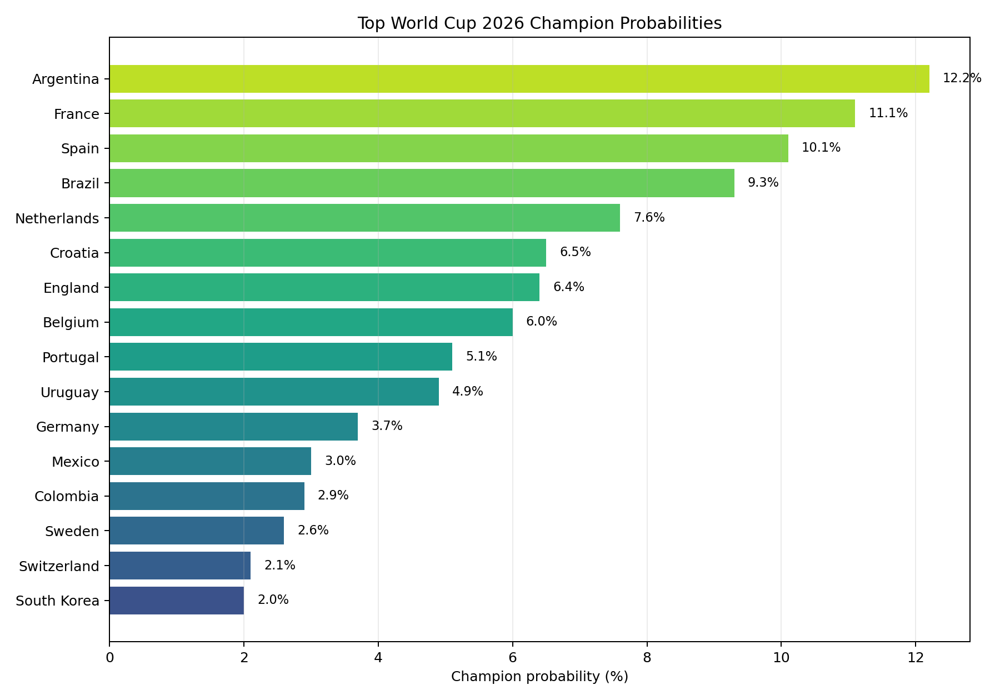
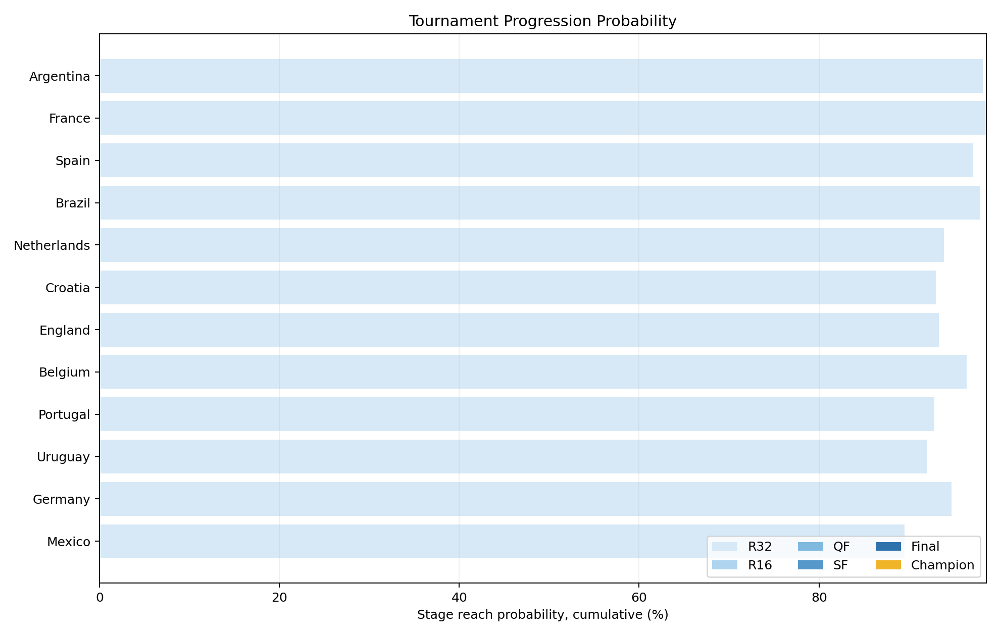
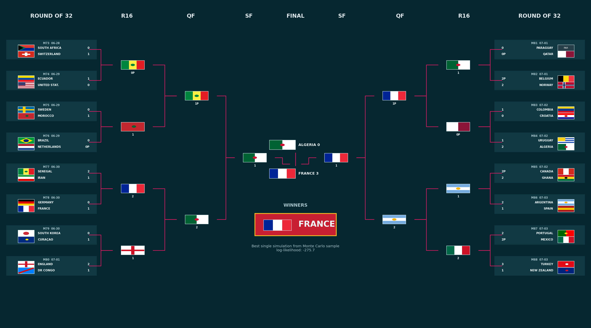
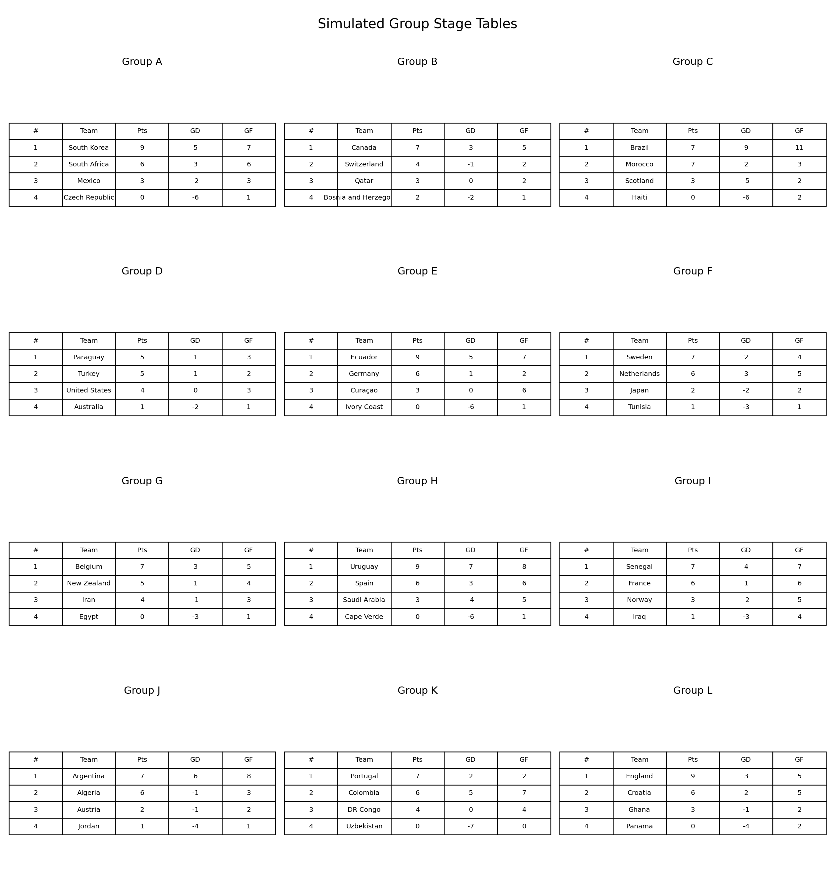
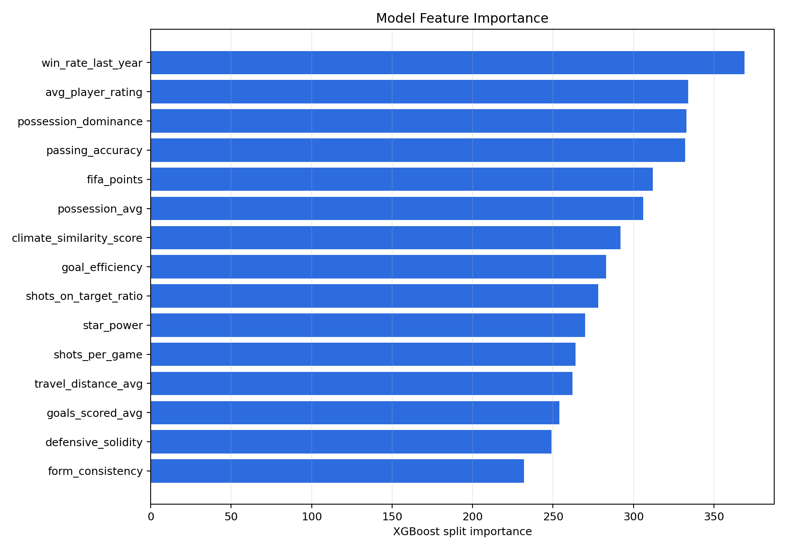

# WC26 Predictor

A machine learning project that simulates the FIFA World Cup 2026 from the real group-stage fixture through the final.

The project now goes beyond single-match winner prediction. It uses the official group fixture, match dates, venues, Round of 32 slots, and knockout dependencies to run 1,000 Monte Carlo tournament simulations. It also selects the highest-likelihood complete tournament path from those simulations and renders a filled broadcast-style tournament tree with country flags.

## Current Features

- Real WC26 fixture file: `data/wc26_real_fixtures.csv`
- 12 official groups and 72 group-stage matches simulated with real match dates and venues.
- Official Match 73-104 knockout slots resolved from the fixture.
- Group-stage standings with draws, points, goal difference, goals scored, and best third-place qualifiers.
- Knockout draws resolved through extra time/penalties.
- Team-level progression probabilities from 1,000 Monte Carlo simulations.
- Highest-likelihood single tournament simulation selected separately from the probability distribution.
- Final report, probability charts, group tables, feature importance plots, and a flag-based tournament tree generated automatically.

## Model Summary

The prediction layer uses the existing `WC26EnsembleModel`:

- XGBoost classifier
- Random Forest classifier
- 60/40 ensemble blend
- Isotonic probability calibration
- Engineered features for strength, attack potency, defensive solidity, squad quality, form consistency, possession dominance, and star power

For tournament simulation, each team receives a model score, and pairwise match probabilities are derived from model-score differences, FIFA rank, and strength index. Scores are generated with a Poisson-based match engine.

Some real WC26 teams are missing from the original Kaggle team-feature dataset. Those teams receive confederation/rank-based fallback feature rows, and this limitation is noted in the final report.

## Key Outputs

Final report:

- `reports/final_report.md`

Simulation tables:

- `outputs/tournament/stage_probabilities.csv`
- `outputs/tournament/best_group_matches.csv`
- `outputs/tournament/best_knockout_matches.csv`
- `outputs/tournament/feature_importance.csv`

Figures:

- `outputs/tournament/figures/champion_probabilities.png`
- `outputs/tournament/figures/stage_probabilities.png`
- `outputs/tournament/figures/group_tables.png`
- `outputs/tournament/figures/tournament_bracket.png`
- `outputs/tournament/figures/tournament_tree_best.png`
- `outputs/tournament/figures/feature_importance.png`

## Latest Simulation Results

From the latest 1,000-run Monte Carlo simulation:

- Highest championship probability: Argentina, about 12.2%
- Highest-likelihood single simulation champion: France
- Best single simulation final: Algeria 0-3 France

These are intentionally different concepts. Monte Carlo probabilities summarize the full distribution across all simulations, while the best single simulation is the most internally consistent complete tournament path among the 1,000 runs.

### Championship Probabilities



| Rank | Team | Champion | Final | Semifinal | Quarterfinal |
| --- | --- | ---: | ---: | ---: | ---: |
| 1 | Argentina | 12.2% | 20.5% | 32.5% | 46.9% |
| 2 | France | 11.1% | 19.1% | 33.2% | 52.9% |
| 3 | Spain | 10.1% | 17.2% | 30.1% | 44.5% |
| 4 | Brazil | 9.3% | 17.2% | 30.0% | 50.1% |
| 5 | Netherlands | 7.6% | 14.6% | 26.5% | 44.6% |
| 6 | Croatia | 6.5% | 11.7% | 21.0% | 39.0% |
| 7 | England | 6.4% | 11.0% | 19.6% | 38.4% |
| 8 | Belgium | 6.0% | 13.4% | 24.9% | 48.6% |
| 9 | Portugal | 5.1% | 11.2% | 20.9% | 39.1% |
| 10 | Uruguay | 4.9% | 9.9% | 18.0% | 32.3% |

### Stage Progression Probabilities



This chart shows each leading team's cumulative probability of reaching the Round of 32, Round of 16, quarterfinal, semifinal, final, and champion stages.

### Best Single Simulation Tournament Tree



The highest-likelihood single tournament path among the 1,000 simulations has France winning the tournament. This tree is not the same as the most likely champion distribution; it represents the most coherent full set of simulated match scores.

### Group Tables and Model Explainability





The feature-importance plot shows that the model relies most heavily on indicators such as `win_rate_last_year`, `avg_player_rating`, `possession_dominance`, `passing_accuracy`, and `fifa_points`.

## Project Structure

```text
WC26 Predictor/
├── data/
│   ├── wc26_real_fixtures.csv       # Real WC26 fixture
│   └── fifa_wc2026_pipeline.py
├── models/
│   ├── ensemble_model.pkl
│   ├── rf_model.pkl
│   └── xgb_model.pkl
├── outputs/
│   └── tournament/
│       ├── best_group_matches.csv
│       ├── best_knockout_matches.csv
│       ├── stage_probabilities.csv
│       └── figures/
├── processed_data/
├── predictions/
├── reports/
│   └── final_report.md
├── src/
│   ├── data_loader.py
│   ├── features.py
│   ├── match_features.py
│   ├── models.py
│   ├── tournament.py
│   ├── validation.py
│   └── visualization.py
├── generate_final_report.py
└── run_cv_validation.py
```

## How to Run

Install dependencies:

```bash
pip install -r requirements.txt
```

Generate the final report and all tournament figures:

```bash
python3 generate_final_report.py --simulations 1000
```

Run syntax checks:

```bash
PYTHONPYCACHEPREFIX=.pycache_tmp python3 -m compileall src generate_final_report.py
```

Run the cross-validation pipeline:

```bash
python3 run_cv_validation.py
```

## Future Work

The next modeling improvement should replace the current team-level winner label with explicit match-level training data. A direct `home_win / draw / away_win` model or score-distribution model would allow draws, expected goals, and knockout outcomes to be learned directly from match-pair features.
