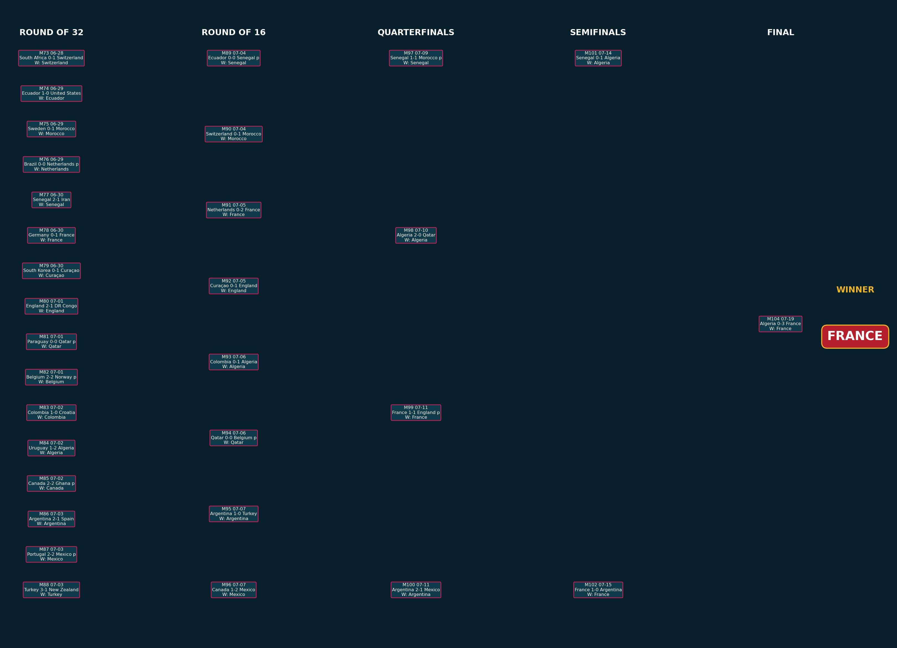

# WC26 Predictor Final Report

## Executive Summary

This report simulates the World Cup 2026 tournament from the group stage through the final using 1,000 Monte Carlo runs. The simulation combines the trained WC26 ensemble model with a score-based Poisson match engine so that group-stage draws, goal difference, best third-place teams, knockout matches, and penalty decisions can all be represented.

Most likely champion by simulation frequency: **Argentina** (12.2%).

Best single simulated tournament path: **France** wins the final against **Algeria**. This path is the highest-likelihood complete simulation among the 1,000 Monte Carlo runs.

## Recent Development Summary

The project was upgraded from a seeded placeholder tournament simulation to a real-fixture simulation workflow. The main additions are:

- Official WC26 group and knockout fixture data in `data/wc26_real_fixtures.csv`.
- Real group-stage dates, venues, and match numbers for all 72 group matches.
- Official Match 73-104 knockout slots, including `Winner Group`, `Runner-up Group`, `3rd Group`, `Winner Match`, and `Loser Match` dependencies.
- A fallback team-feature strategy for real WC26 teams that are missing from the original Kaggle team dataset.
- A 1,000-run Monte Carlo pipeline that produces team progression probabilities.
- A best-single-simulation selector that chooses the highest-likelihood complete tournament path from the Monte Carlo sample.
- A two-sided tournament tree image inspired by broadcast-style World Cup bracket graphics.

## Methodology

- Fixture source: `data/wc26_real_fixtures.csv`, parsed from the public FIFA/Wikipedia fixture listing.
- Groups: official 2026 World Cup groups and group match dates/venues from the fixture file.
- Group matches: Poisson score sampling from team attack, opponent defense, and pairwise model strength.
- Knockout qualification: group winners, runners-up, and the best eight third-place teams.
- Knockout bracket: official match slots from Match 73 through Match 104.
- Third-place Round of 32 slots: resolved by selecting the strongest qualifying third-place team from each slot's allowed group set.
- Knockout draws: resolved by the pairwise win probability as extra time/penalties.
- Data caveat: teams absent from the Kaggle team-feature data receive confederation/rank-based fallback features.

## Model Notes

The existing ensemble is a calibrated XGBoost and Random Forest model trained on team-level winner labels. For tournament use, each team receives a model score and pairwise probabilities are derived from the difference between team model scores, strength index, and FIFA rank.

Recommended next model upgrade: retrain on explicit match-level rows with `home_win / draw / away_win` labels and direct team-difference features.

## Key Visuals

## Generated Artifacts

| Artifact | Description |
| --- | --- |
| `outputs/tournament/stage_probabilities.csv` | Team-level probabilities for reaching each tournament stage across 1,000 simulations. |
| `outputs/tournament/best_group_matches.csv` | Group-stage matches from the highest-likelihood complete simulation. |
| `outputs/tournament/best_knockout_matches.csv` | Knockout-stage matches from the highest-likelihood complete simulation. |
| `outputs/tournament/figures/tournament_tree_best.png` | Filled two-sided tournament tree for the best single simulation. |
| `outputs/tournament/figures/champion_probabilities.png` | Top champion probabilities across all Monte Carlo simulations. |
| `outputs/tournament/figures/stage_probabilities.png` | Cumulative stage reach probabilities for leading teams. |
| `outputs/tournament/figures/group_tables.png` | Group tables from the best single simulation. |
| `outputs/tournament/figures/feature_importance.png` | Top XGBoost feature importances from the trained model. |

## Champion Probability Table

| team | country_code | fifa_rank | round_of_16_prob | quarterfinal_prob | semifinal_prob | final_prob | champion_prob |
| --- | --- | --- | --- | --- | --- | --- | --- |
| Argentina | ARG | 1.000 | 0.622 | 0.469 | 0.325 | 0.205 | 0.122 |
| France | FRA | 1.000 | 0.785 | 0.529 | 0.332 | 0.191 | 0.111 |
| Spain | ESP | 1.000 | 0.666 | 0.445 | 0.301 | 0.172 | 0.101 |
| Brazil | BRA | 1.000 | 0.668 | 0.501 | 0.300 | 0.172 | 0.093 |
| Netherlands | NED | 5.000 | 0.641 | 0.446 | 0.265 | 0.146 | 0.076 |
| Croatia | CRO | 5.000 | 0.643 | 0.390 | 0.210 | 0.117 | 0.065 |
| England | ENG | 1.000 | 0.636 | 0.384 | 0.196 | 0.110 | 0.064 |
| Belgium | BEL | 5.000 | 0.701 | 0.486 | 0.249 | 0.134 | 0.060 |
| Portugal | POR | 5.000 | 0.626 | 0.391 | 0.209 | 0.112 | 0.051 |
| Uruguay | URU | 5.000 | 0.541 | 0.323 | 0.180 | 0.099 | 0.049 |
| Germany | DEU | 5.000 | 0.662 | 0.325 | 0.176 | 0.089 | 0.037 |
| Mexico | MEX | 12.000 | 0.597 | 0.299 | 0.153 | 0.071 | 0.030 |

## Simulated Knockout Path

| match_number | date | stage | team_a | team_b | score | winner | decided_by | team_a_win_probability | log_probability | venue |
| --- | --- | --- | --- | --- | --- | --- | --- | --- | --- | --- |
| 73 | 2026-06-28 | Round of 32 | South Africa | Switzerland | 0-1 | Switzerland | 90 minutes | 0.148 | -2.007 | SoFi Stadium, Inglewood |
| 74 | 2026-06-29 | Round of 32 | Ecuador | United States | 1-0 | Ecuador | 90 minutes | 0.301 | -2.252 | Gillette Stadium, Foxborough |
| 75 | 2026-06-29 | Round of 32 | Sweden | Morocco | 0-1 | Morocco | 90 minutes | 0.660 | -2.538 | Estadio BBVA, Guadalupe |
| 76 | 2026-06-29 | Round of 32 | Brazil | Netherlands | 0-0 | Netherlands | extra time/penalties | 0.519 | -3.379 | NRG Stadium, Houston |
| 77 | 2026-06-30 | Round of 32 | Senegal | Iran | 2-1 | Senegal | 90 minutes | 0.534 | -2.372 | MetLife Stadium, East Rutherford |
| 78 | 2026-06-30 | Round of 32 | Germany | France | 0-1 | France | 90 minutes | 0.469 | -2.387 | AT&T Stadium, Arlington |
| 79 | 2026-06-30 | Round of 32 | South Korea | Curaçao | 0-1 | Curaçao | 90 minutes | 0.746 | -2.428 | Estadio Azteca, Mexico City |
| 80 | 2026-07-01 | Round of 32 | England | DR Congo | 2-1 | England | 90 minutes | 0.780 | -2.355 | Mercedes-Benz Stadium, Atlanta |
| 81 | 2026-07-01 | Round of 32 | Paraguay | Qatar | 0-0 | Qatar | extra time/penalties | 0.506 | -2.784 | Levi's Stadium, Santa Clara |
| 82 | 2026-07-01 | Round of 32 | Belgium | Norway | 2-2 | Belgium | extra time/penalties | 0.844 | -3.635 | Lumen Field, Seattle |
| 83 | 2026-07-02 | Round of 32 | Colombia | Croatia | 1-0 | Colombia | 90 minutes | 0.535 | -2.303 | BMO Field, Toronto |
| 84 | 2026-07-02 | Round of 32 | Uruguay | Algeria | 1-2 | Algeria | 90 minutes | 0.846 | -3.162 | SoFi Stadium, Inglewood |
| 85 | 2026-07-02 | Round of 32 | Canada | Ghana | 2-2 | Canada | extra time/penalties | 0.679 | -3.272 | BC Place, Vancouver |
| 86 | 2026-07-03 | Round of 32 | Argentina | Spain | 2-1 | Argentina | 90 minutes | 0.501 | -2.442 | Hard Rock Stadium, Miami Gardens |
| 87 | 2026-07-03 | Round of 32 | Portugal | Mexico | 2-2 | Mexico | extra time/penalties | 0.523 | -3.837 | Arrowhead Stadium, Kansas City |
| 88 | 2026-07-03 | Round of 32 | Turkey | New Zealand | 3-1 | Turkey | 90 minutes | 0.796 | -3.342 | AT&T Stadium, Arlington |
| 89 | 2026-07-04 | Round of 16 | Ecuador | Senegal | 0-0 | Senegal | extra time/penalties | 0.503 | -2.902 | Lincoln Financial Field, Philadelphia |
| 90 | 2026-07-04 | Round of 16 | Switzerland | Morocco | 0-1 | Morocco | 90 minutes | 0.656 | -2.334 | NRG Stadium, Houston |
| 91 | 2026-07-05 | Round of 16 | Netherlands | France | 0-2 | France | 90 minutes | 0.473 | -2.752 | MetLife Stadium, East Rutherford |
| 92 | 2026-07-05 | Round of 16 | Curaçao | England | 0-1 | England | 90 minutes | 0.348 | -1.936 | Estadio Azteca, Mexico City |
| 93 | 2026-07-06 | Round of 16 | Colombia | Algeria | 0-1 | Algeria | 90 minutes | 0.836 | -2.637 | AT&T Stadium, Arlington |
| 94 | 2026-07-06 | Round of 16 | Qatar | Belgium | 0-0 | Qatar | extra time/penalties | 0.404 | -3.064 | Lumen Field, Seattle |
| 95 | 2026-07-07 | Round of 16 | Argentina | Turkey | 1-0 | Argentina | 90 minutes | 0.606 | -1.892 | Mercedes-Benz Stadium, Atlanta |
| 96 | 2026-07-07 | Round of 16 | Canada | Mexico | 1-2 | Mexico | 90 minutes | 0.306 | -2.321 | BC Place, Vancouver |
| 97 | 2026-07-09 | Quarterfinals | Senegal | Morocco | 1-1 | Senegal | extra time/penalties | 0.304 | -3.230 | Gillette Stadium, Foxborough |
| 98 | 2026-07-10 | Quarterfinals | Algeria | Qatar | 2-0 | Algeria | 90 minutes | 0.206 | -2.870 | SoFi Stadium, Inglewood |
| 99 | 2026-07-11 | Quarterfinals | France | England | 1-1 | France | extra time/penalties | 0.668 | -2.503 | Hard Rock Stadium, Miami Gardens |
| 100 | 2026-07-11 | Quarterfinals | Argentina | Mexico | 2-1 | Argentina | 90 minutes | 0.553 | -2.356 | Arrowhead Stadium, Kansas City |
| 101 | 2026-07-14 | Semifinals | Senegal | Algeria | 0-1 | Algeria | 90 minutes | 0.539 | -2.266 | AT&T Stadium, Arlington |
| 102 | 2026-07-15 | Semifinals | France | Argentina | 1-0 | France | 90 minutes | 0.503 | -2.429 | Mercedes-Benz Stadium, Atlanta |
| 103 | 2026-07-18 | Match for third place | Senegal | Argentina | 1-2 | Argentina | 90 minutes | 0.157 | -2.356 | Hard Rock Stadium, Miami Gardens |
| 104 | 2026-07-19 | Final | Algeria | France | 0-3 | France | 90 minutes | 0.136 | -2.413 | MetLife Stadium, East Rutherford |

## Simulated Group Tables

| group | position | team | points | gd | gf |
| --- | --- | --- | --- | --- | --- |
| A | 1 | South Korea | 9 | 5 | 7 |
| A | 2 | South Africa | 6 | 3 | 6 |
| A | 3 | Mexico | 3 | -2 | 3 |
| A | 4 | Czech Republic | 0 | -6 | 1 |
| B | 1 | Canada | 7 | 3 | 5 |
| B | 2 | Switzerland | 4 | -1 | 2 |
| B | 3 | Qatar | 3 | 0 | 2 |
| B | 4 | Bosnia and Herzegovina | 2 | -2 | 1 |
| C | 1 | Brazil | 7 | 9 | 11 |
| C | 2 | Morocco | 7 | 2 | 3 |
| C | 3 | Scotland | 3 | -5 | 2 |
| C | 4 | Haiti | 0 | -6 | 2 |
| D | 1 | Paraguay | 5 | 1 | 3 |
| D | 2 | Turkey | 5 | 1 | 2 |
| D | 3 | United States | 4 | 0 | 3 |
| D | 4 | Australia | 1 | -2 | 1 |
| E | 1 | Ecuador | 9 | 5 | 7 |
| E | 2 | Germany | 6 | 1 | 2 |
| E | 3 | Curaçao | 3 | 0 | 6 |
| E | 4 | Ivory Coast | 0 | -6 | 1 |
| F | 1 | Sweden | 7 | 2 | 4 |
| F | 2 | Netherlands | 6 | 3 | 5 |
| F | 3 | Japan | 2 | -2 | 2 |
| F | 4 | Tunisia | 1 | -3 | 1 |
| G | 1 | Belgium | 7 | 3 | 5 |
| G | 2 | New Zealand | 5 | 1 | 4 |
| G | 3 | Iran | 4 | -1 | 3 |
| G | 4 | Egypt | 0 | -3 | 1 |
| H | 1 | Uruguay | 9 | 7 | 8 |
| H | 2 | Spain | 6 | 3 | 6 |
| H | 3 | Saudi Arabia | 3 | -4 | 5 |
| H | 4 | Cape Verde | 0 | -6 | 1 |
| I | 1 | Senegal | 7 | 4 | 7 |
| I | 2 | France | 6 | 1 | 6 |
| I | 3 | Norway | 3 | -2 | 5 |
| I | 4 | Iraq | 1 | -3 | 4 |
| J | 1 | Argentina | 7 | 6 | 8 |
| J | 2 | Algeria | 6 | -1 | 3 |
| J | 3 | Austria | 2 | -1 | 2 |
| J | 4 | Jordan | 1 | -4 | 1 |
| K | 1 | Portugal | 7 | 2 | 2 |
| K | 2 | Colombia | 6 | 5 | 7 |
| K | 3 | DR Congo | 4 | 0 | 4 |
| K | 4 | Uzbekistan | 0 | -7 | 0 |
| L | 1 | England | 9 | 3 | 5 |
| L | 2 | Croatia | 6 | 2 | 5 |
| L | 3 | Ghana | 3 | -1 | 2 |
| L | 4 | Panama | 0 | -4 | 2 |

## Simulated Group Matches

| match_number | date | stage | team_a | team_b | score | winner | decided_by | team_a_win_probability | log_probability | venue |
| --- | --- | --- | --- | --- | --- | --- | --- | --- | --- | --- |
| 1 | 2026-06-11 | Group | Mexico | South Africa | 1-2 | South Africa | 90 minutes | 0.851 | -3.060 | Estadio Azteca, Mexico City |
| 2 | 2026-06-11 | Group | South Korea | Czech Republic | 2-1 | South Korea | 90 minutes | 0.836 | -2.343 | Estadio Akron, Zapopan |
| 25 | 2026-06-18 | Group | Czech Republic | South Africa | 0-3 | South Africa | 90 minutes | 0.523 | -3.322 | Mercedes-Benz Stadium, Atlanta |
| 28 | 2026-06-18 | Group | Mexico | South Korea | 0-3 | South Korea | 90 minutes | 0.504 | -3.623 | Estadio Akron, Zapopan |
| 53 | 2026-06-24 | Group | Czech Republic | Mexico | 0-2 | Mexico | 90 minutes | 0.161 | -2.153 | Estadio Azteca, Mexico City |
| 54 | 2026-06-24 | Group | South Africa | South Korea | 1-2 | South Korea | 90 minutes | 0.152 | -2.342 | Estadio BBVA, Guadalupe |
| 3 | 2026-06-12 | Group | Canada | Bosnia and Herzegovina | 1-1 | Draw | 90 minutes | 0.733 | -2.296 | BMO Field, Toronto |
| 8 | 2026-06-13 | Group | Qatar | Switzerland | 0-1 | Switzerland | 90 minutes | 0.430 | -1.964 | Levi's Stadium, Santa Clara |
| 26 | 2026-06-18 | Group | Switzerland | Bosnia and Herzegovina | 0-0 | Draw | 90 minutes | 0.862 | -2.870 | SoFi Stadium, Inglewood |
| 27 | 2026-06-18 | Group | Canada | Qatar | 1-0 | Canada | 90 minutes | 0.368 | -2.301 | BC Place, Vancouver |
| 51 | 2026-06-24 | Group | Switzerland | Canada | 1-3 | Canada | 90 minutes | 0.695 | -3.595 | BC Place, Vancouver |
| 52 | 2026-06-24 | Group | Bosnia and Herzegovina | Qatar | 0-2 | Qatar | 90 minutes | 0.175 | -2.308 | Lumen Field, Seattle |
| 5 | 2026-06-13 | Group | Haiti | Scotland | 1-2 | Scotland | 90 minutes | 0.621 | -2.769 | Gillette Stadium, Foxborough |
| 7 | 2026-06-13 | Group | Brazil | Morocco | 1-1 | Draw | 90 minutes | 0.698 | -2.397 | MetLife Stadium, East Rutherford |
| 29 | 2026-06-19 | Group | Brazil | Haiti | 5-1 | Brazil | 90 minutes | 0.786 | -4.055 | Lincoln Financial Field, Philadelphia |
| 30 | 2026-06-19 | Group | Scotland | Morocco | 0-1 | Morocco | 90 minutes | 0.278 | -2.200 | Gillette Stadium, Foxborough |
| 49 | 2026-06-24 | Group | Scotland | Brazil | 0-5 | Brazil | 90 minutes | 0.142 | -3.131 | Hard Rock Stadium, Miami Gardens |
| 50 | 2026-06-24 | Group | Morocco | Haiti | 1-0 | Morocco | 90 minutes | 0.614 | -2.122 | Mercedes-Benz Stadium, Atlanta |
| 4 | 2026-06-12 | Group | United States | Paraguay | 1-1 | Draw | 90 minutes | 0.412 | -2.107 | SoFi Stadium, Inglewood |
| 6 | 2026-06-13 | Group | Australia | Turkey | 0-0 | Draw | 90 minutes | 0.392 | -2.084 | BC Place, Vancouver |
| 31 | 2026-06-19 | Group | Turkey | Paraguay | 1-1 | Draw | 90 minutes | 0.509 | -2.057 | Levi's Stadium, Santa Clara |
| 32 | 2026-06-19 | Group | United States | Australia | 2-1 | United States | 90 minutes | 0.512 | -2.595 | Lumen Field, Seattle |
| 59 | 2026-06-25 | Group | Turkey | United States | 1-0 | Turkey | 90 minutes | 0.597 | -2.244 | SoFi Stadium, Inglewood |
| 60 | 2026-06-25 | Group | Paraguay | Australia | 1-0 | Paraguay | 90 minutes | 0.599 | -2.423 | Levi's Stadium, Santa Clara |
| 9 | 2026-06-14 | Group | Ivory Coast | Ecuador | 0-2 | Ecuador | 90 minutes | 0.462 | -2.224 | Lincoln Financial Field, Philadelphia |
| 10 | 2026-06-14 | Group | Germany | Curaçao | 1-0 | Germany | 90 minutes | 0.769 | -2.163 | NRG Stadium, Houston |
| 33 | 2026-06-20 | Group | Germany | Ivory Coast | 1-0 | Germany | 90 minutes | 0.847 | -2.152 | BMO Field, Toronto |
| 34 | 2026-06-20 | Group | Ecuador | Curaçao | 4-2 | Ecuador | 90 minutes | 0.412 | -5.494 | Arrowhead Stadium, Kansas City |
| 55 | 2026-06-25 | Group | Curaçao | Ivory Coast | 4-1 | Curaçao | 90 minutes | 0.625 | -4.194 | Lincoln Financial Field, Philadelphia |
| 56 | 2026-06-25 | Group | Ecuador | Germany | 1-0 | Ecuador | 90 minutes | 0.174 | -2.800 | MetLife Stadium, East Rutherford |
| 11 | 2026-06-14 | Group | Netherlands | Japan | 2-0 | Netherlands | 90 minutes | 0.753 | -2.227 | AT&T Stadium, Arlington |
| 12 | 2026-06-14 | Group | Sweden | Tunisia | 1-0 | Sweden | 90 minutes | 0.835 | -2.196 | Estadio BBVA, Guadalupe |
| 35 | 2026-06-20 | Group | Netherlands | Sweden | 1-2 | Sweden | 90 minutes | 0.525 | -2.791 | NRG Stadium, Houston |
| 36 | 2026-06-20 | Group | Tunisia | Japan | 1-1 | Draw | 90 minutes | 0.354 | -2.132 | Estadio BBVA, Guadalupe |
| 57 | 2026-06-25 | Group | Japan | Sweden | 1-1 | Draw | 90 minutes | 0.266 | -2.235 | AT&T Stadium, Arlington |
| 58 | 2026-06-25 | Group | Tunisia | Netherlands | 0-2 | Netherlands | 90 minutes | 0.152 | -1.983 | Arrowhead Stadium, Kansas City |
| 15 | 2026-06-15 | Group | Iran | New Zealand | 1-1 | Draw | 90 minutes | 0.494 | -2.149 | SoFi Stadium, Inglewood |
| 16 | 2026-06-15 | Group | Belgium | Egypt | 1-0 | Belgium | 90 minutes | 0.848 | -2.085 | Lumen Field, Seattle |
| 39 | 2026-06-21 | Group | Belgium | Iran | 3-1 | Belgium | 90 minutes | 0.847 | -2.589 | SoFi Stadium, Inglewood |
| 40 | 2026-06-21 | Group | New Zealand | Egypt | 2-1 | New Zealand | 90 minutes | 0.507 | -2.485 | BC Place, Vancouver |
| 63 | 2026-06-26 | Group | Egypt | Iran | 0-1 | Iran | 90 minutes | 0.499 | -2.540 | Lumen Field, Seattle |
| 64 | 2026-06-26 | Group | New Zealand | Belgium | 1-1 | Draw | 90 minutes | 0.156 | -2.341 | BC Place, Vancouver |
| 13 | 2026-06-15 | Group | Saudi Arabia | Uruguay | 1-5 | Uruguay | 90 minutes | 0.157 | -4.148 | Hard Rock Stadium, Miami Gardens |
| 14 | 2026-06-15 | Group | Spain | Cape Verde | 3-0 | Spain | 90 minutes | 0.881 | -2.366 | Mercedes-Benz Stadium, Atlanta |
| 37 | 2026-06-21 | Group | Uruguay | Cape Verde | 2-0 | Uruguay | 90 minutes | 0.868 | -2.155 | Hard Rock Stadium, Miami Gardens |
| 38 | 2026-06-21 | Group | Spain | Saudi Arabia | 3-2 | Spain | 90 minutes | 0.859 | -3.582 | Mercedes-Benz Stadium, Atlanta |
| 65 | 2026-06-26 | Group | Cape Verde | Saudi Arabia | 1-2 | Saudi Arabia | 90 minutes | 0.451 | -2.617 | NRG Stadium, Houston |
| 66 | 2026-06-26 | Group | Uruguay | Spain | 1-0 | Uruguay | 90 minutes | 0.469 | -2.806 | Estadio Akron, Zapopan |
| 17 | 2026-06-16 | Group | France | Senegal | 0-2 | Senegal | 90 minutes | 0.845 | -4.017 | MetLife Stadium, East Rutherford |
| 18 | 2026-06-16 | Group | Iraq | Norway | 1-2 | Norway | 90 minutes | 0.459 | -2.473 | Gillette Stadium, Foxborough |
| 41 | 2026-06-22 | Group | Norway | Senegal | 1-3 | Senegal | 90 minutes | 0.472 | -2.942 | MetLife Stadium, East Rutherford |
| 42 | 2026-06-22 | Group | France | Iraq | 3-1 | France | 90 minutes | 0.878 | -2.598 | Lincoln Financial Field, Philadelphia |
| 61 | 2026-06-26 | Group | Norway | France | 2-3 | France | 90 minutes | 0.141 | -3.526 | Gillette Stadium, Foxborough |
| 62 | 2026-06-26 | Group | Senegal | Iraq | 2-2 | Draw | 90 minutes | 0.569 | -3.054 | BMO Field, Toronto |
| 19 | 2026-06-16 | Group | Argentina | Algeria | 3-0 | Argentina | 90 minutes | 0.863 | -2.314 | Arrowhead Stadium, Kansas City |
| 20 | 2026-06-16 | Group | Austria | Jordan | 0-0 | Draw | 90 minutes | 0.747 | -2.507 | Levi's Stadium, Santa Clara |
| 43 | 2026-06-22 | Group | Argentina | Austria | 1-1 | Draw | 90 minutes | 0.714 | -2.344 | AT&T Stadium, Arlington |
| 44 | 2026-06-22 | Group | Jordan | Algeria | 0-1 | Algeria | 90 minutes | 0.461 | -2.112 | Levi's Stadium, Santa Clara |
| 69 | 2026-06-27 | Group | Algeria | Austria | 2-1 | Algeria | 90 minutes | 0.284 | -2.708 | Arrowhead Stadium, Kansas City |
| 70 | 2026-06-27 | Group | Jordan | Argentina | 1-4 | Argentina | 90 minutes | 0.120 | -3.086 | AT&T Stadium, Arlington |
| 23 | 2026-06-17 | Group | Portugal | DR Congo | 0-0 | Draw | 90 minutes | 0.861 | -2.678 | NRG Stadium, Houston |
| 24 | 2026-06-17 | Group | Uzbekistan | Colombia | 0-3 | Colombia | 90 minutes | 0.155 | -2.498 | Estadio Azteca, Mexico City |
| 47 | 2026-06-23 | Group | Portugal | Uzbekistan | 1-0 | Portugal | 90 minutes | 0.856 | -1.975 | NRG Stadium, Houston |
| 48 | 2026-06-23 | Group | Colombia | DR Congo | 4-1 | Colombia | 90 minutes | 0.850 | -3.530 | Estadio Akron, Zapopan |
| 71 | 2026-06-27 | Group | Colombia | Portugal | 0-1 | Portugal | 90 minutes | 0.477 | -2.223 | Hard Rock Stadium, Miami Gardens |
| 72 | 2026-06-27 | Group | DR Congo | Uzbekistan | 3-0 | DR Congo | 90 minutes | 0.490 | -3.303 | Mercedes-Benz Stadium, Atlanta |
| 21 | 2026-06-17 | Group | Ghana | Panama | 2-0 | Ghana | 90 minutes | 0.493 | -2.698 | Toronto Stadium, Toronto |
| 22 | 2026-06-17 | Group | England | Croatia | 2-1 | England | 90 minutes | 0.418 | -2.510 | AT&T Stadium, Arlington |
| 45 | 2026-06-23 | Group | England | Ghana | 1-0 | England | 90 minutes | 0.750 | -2.241 | Gillette Stadium, Foxborough |
| 46 | 2026-06-23 | Group | Panama | Croatia | 1-2 | Croatia | 90 minutes | 0.198 | -2.360 | Toronto Stadium, Toronto |
| 67 | 2026-06-27 | Group | Panama | England | 1-2 | England | 90 minutes | 0.256 | -2.378 | MetLife Stadium, East Rutherford |
| 68 | 2026-06-27 | Group | Croatia | Ghana | 2-0 | Croatia | 90 minutes | 0.807 | -2.037 | Lincoln Financial Field, Philadelphia |

## Top Feature Importances

| feature_name | importance |
| --- | --- |
| win_rate_last_year | 369.000 |
| avg_player_rating | 334.000 |
| possession_dominance | 333.000 |
| passing_accuracy | 332.000 |
| fifa_points | 312.000 |
| possession_avg | 306.000 |
| climate_similarity_score | 292.000 |
| goal_efficiency | 283.000 |
| shots_on_target_ratio | 278.000 |
| star_power | 270.000 |
| shots_per_game | 264.000 |
| travel_distance_avg | 262.000 |
| goals_scored_avg | 254.000 |
| defensive_solidity | 249.000 |
| form_consistency | 232.000 |

## Interpretation

Because the model is currently team-level rather than match-level, the probabilities should be read as a structured simulation baseline rather than a final betting-grade forecast. The most important improvement is to create historical match pair rows and teach the model draws and score distributions directly.
